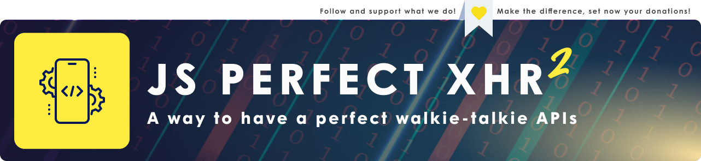

[<sub></sub>](https://github.com/js-collection)
---
# xhr-perfect-model



<table>
  <tr>
    <td width="999" align="center"> <a href="https://github.com/js-collection/xhr-perfect-model/releases"> 💾 Stable relesed list </a> </td>
    <td width="999" align="center"> <a href="https://github.com/js-collection/xhr-perfect-model/tree/released"> 💎 Latest release </a> </td>
    <td width="999" align="center"> <a href="https://github.com/js-collection/xhr-perfect-model/tree/development"> ⚙️ Unstable / Devs </a> </td>
    <td width="999" align="center"> <a href="./licence.md"> ⚖️ Licence roles </a> </td>
  </tr>
</table>

---

## 📃 Info:

#### WHAT IS IT?
An asset model for make the smallest xhr walkie talkie client system. <br>

#### WHY CHOOSE IT?
Unlike some other competitors, this system does not have compilers, special protocols and a framework but a simple micro-library. Its strength is in its simplicity... It is a simple "walkie-talkie" method (so it collects the data of a form and packages it for sending to the server and waits for or tracks a response) created in simple vanilla Js and web APIs. So simple that its router itself is a suggestion, a preset to be hard-coded to expand as you wish. The advantage becomes your freedom... you decide everything as long as it concerns web formData, text and json. This system, not being a framework, does not affect server sides and only requires a response json similar to common standards such as those suggested in the code and in the manual. That's all ;)<br>

#### WHO DID THAT?
This is an open project built by Alberto Marangelo (@berto-dev) [¹](https://berto.dev) [²](https://github.com/berto-dev) for Deveet Technologies [¹](https://deveet.com) [²](https://github.com/Deveet-Technologies)<br>
<sup>If you use in your blog it's a good idea to include <i>"taken from original GITPAGE of the AUTHORSLINK"</i></sup>
<br><br>

## 🆘 Before flight:
- **Remember**: This is the client side script, it's not the server side!<br>
- **Remember** to change your api base root the class in place of the [`http://yoursitewithapi:YOURPORTNUMBER/`](https://github.com/js-collection/xhr-perfect-model/blob/development/xhr-classic.js#L2) placeholder.<br>
- **Remember** to register your api into the class in place of the [`connectors_ENDPOINT_SECTOR`](https://github.com/js-collection/xhr-perfect-model/blob/development/xhr-classic.js#L175) placeholder. You can registre infinite api sectors.<br>
- **SYNC ASYNC IN SHORT**: Sync and Async scripts are both the same but the first it's liniear and much simple to undestanding. Instead, the async offer more possibilities and rapidity to execution, but need to be encapsulated into an async function wrapper and inside have more complex syntax... For someone the async rappresent a [chaos and hard programming style](https://www.google.com/search?q=async+it%27s+too+complex&oq=async+it%27s+too+complex&gs_lcrp=EgZjaHJvbWUyBggAEEUYOTIGCAEQRRg80gEJMTA3MTdqMGo0qAIAsAIA&sourceid=chrome&ie=UTF-8#ip=1) but, again, for other one, Sync is not good because can encurred in a ["callback hell"](https://www.google.com/search?q=what%27s+callback+hell&oq=callback+hell+what&gs_lcrp=EgZjaHJvbWUqCAgBEAAYFhgeMgYIABBFGDkyCAgBEAAYFhge0gEIMzY3OGowajeoAgCwAgA&sourceid=chrome&ie=UTF-8)... it's a choose.<br><br>

## *️⃣ What it do:
This is a simplest, but complete, model to make client side walkie talkie ( it's a method to send and receiving information to/from server ) restful system.
<br><br>

<br><br>
So, in short, you collect the data from form or function, put it in the class, the class "transfer" via a presetted xhr protocol the data and waiting a response from it. When the response reached it's served to you. In the same time, if you have a progression ( an exemple a big json or files ) you can get it easly ( it's all just presetted ;) ). That's the piece of cake.
<br><br>
You can use all you want into the form, or not use the form with a complete new custom function, it's not important! This asset make a simple class as  preset for a web restful data (text, file or text json) transferts... not else.
<br><br>

## 📑 How to:

### Requirements: 

- an endpoint for a restful api 
- suggested a good walkie talkie system 
- in node / express you sure need to able express.text (if you buffering the trasmission) or json+urlencoded (not tested)


### Usage:

- Load class into you web page, like this:
  ```js
  <script src=".../xhr-classic.js"></script>
  //or xhr-async.js or rename it
  ```

- make a form with you data or a function for you API, like:
  ```html
    <html>
      <form id="test">
          <!--THIS IS A STUPID MODEL, MAKE YOU A CUSTOM DATA-->
          <input multiple="false" name="collector" type="file">
          <input name="test" type="text" placeholder="write every you wont ;)">
          <button name="tester">TEST DATA</button>
      </form>
    </html>
    <script>
      window.onload = () => {
        if (document.readyState == 'complete') {
  
          //test api and system
          function API_TEST() {
  
            let form = document.forms[ 'test' ],
                formfiles = form['collector'],
                testnow = form[ 'tester' ]
  
             testnow.onclick = () => {
                 //do operations and call api...
             }
  
         }
  
       }
     }
    </script>
  ```

- _XHR CLASSIC:_ use asset to call the class for talk with your api walkie talkie like this:

  ```js
  // set endpoint target profile (it's a demo)

  var profile = { 
      action :'demo-upload-file'
  }
  
  // set endpoint target required parameters

  var params  = {
      file  : formfiles.files[i],
      name  : form['name'].value||formfiles.files[i].name,
      // other : ...
    }
  
  // api call model   

  api.transfer(
    [profile,params],
    progress => console.log("in progress...", progress) ,
    results => console.log("data in back : ",results)
  )
  ```

  How you can easy see, after setted a target in profile and the correct params of your api endpoint, you have 2 callback:
  - progress return the object with progression data sended (an exemple, the bytes and percentage of file sending) and it is called for many times how steps needed for completation (or failing)
  - results is the final data resulted of operations... the payloads, the restful json object of end operations
 
- _XHR ASYNC:_ in an async function or asset, use below codes to call the class for talk with your api walkie talkie like this:

  ```js
  // set endpoint target profile (it's a demo)

  var profile = { 
      action :'demo-upload-file'
  }
  
  // set endpoint target required parameters

  var params  = {
      file  : formfiles.files[i],
      name  : form['name'].value||formfiles.files[i].name,
      // other : ...
    }
    
  // api call style models : style zero (no async)
  
  await api.transfer(
      [action, params],
      progress=> { console.log("progress:", progress) },
      result=> { console.log("results:", result) }
  )
  
  
  // api call style models : style one (partial sync)
  const result = await api.transfer( [action, params], progress => { console.log("progress:", progress) }).result()
  console.log("result", result )
  
  
  // api call style models : style two (destructured partial async)
  const { result } = await api.transfer( [action, params], progress => { console.log("progress:", progress ) })
  console.log("result", await result() )
  

  // api call style models : style three (full destructured async )
  const { progress, result } = api.transfer( [action, params] )
  progress( progress => console.log("progress:", progress) )
  console.log("result:", await result() )
  
  
  // api call style models : style four (procedural async)
  const transit  = api.transfer( [action, params] )
  const progress = transit.progress( $ => console.log("progress:", $) )
  const result  = await transit.result()
  console.log("result:", result)
  

  // api call style models : shorted (transmitted wait direct result without progress):
  const result = await api.transmitted( [action, params] )
  console.log("result", result )
  ```

